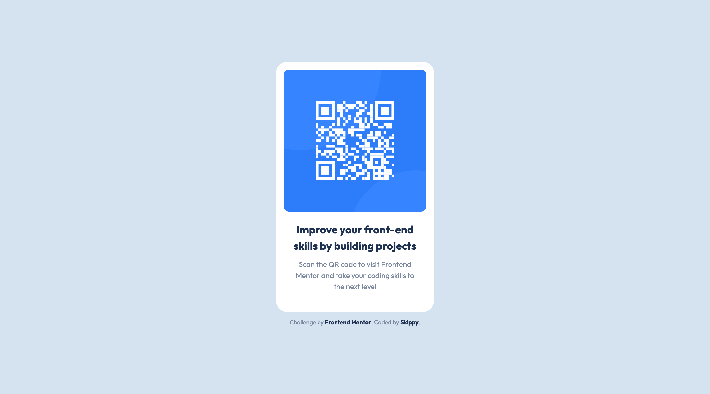

# Frontend Mentor - QR code component solution

This is a solution to the [QR code component challenge on Frontend Mentor](https://www.frontendmentor.io/challenges/qr-code-component-iux_sIO_H). Frontend Mentor challenges help you improve your coding skills by building realistic projects.

## Table of contents

- [Overview](#overview)
  - [Screenshot](#screenshot)
  - [Links](#links)
- [My process](#my-process)
  - [Built with](#built-with)
  - [Useful resources](#useful-resources)
- [Author](#author)

## Overview

### Screenshot

### Links

- Solution URL: [GitHub Pages](https://skippysworld.github.io/QR-Code-Console/)

## My process

### Built with

- Semantic HTML5 markup
- CSS properties & flexbox
- [Google Fonts](https://https://fonts.google.com//)

### Useful resources

- [A modern CSS Reset](https://piccalil.li/blog/a-modern-css-reset/) - I heard about CSS Reset templates during my online course.. There is a lot of options out there, but I've decided to start with this one.

## Author

- Frontend Mentor - [@skippysworld](https://www.frontendmentor.io/profile/skippysworld)
